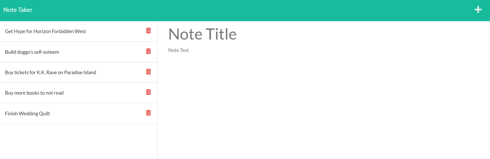

# wrote-a-note

## Description
Remember all those times you wanted to keep track of something and get it written down while you were thinking about it, but now you're swimming in a sea of sticky notes? Fixed that for you.

_App Sample Screenshot_

### Access

Clone the repository to your local machine, navigate to the root directory of the repository, then run "node server.js" from the command line or access the live deployed version [here](https://fathomless-waters-89109.herokuapp.com/).

### Future Enhancements Roadmap

* add id validation for deleting a task
* add note categories
* color enhancements
